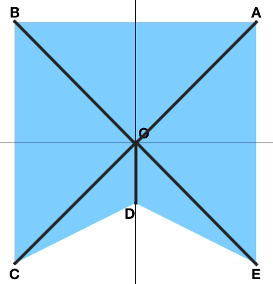

[문제 링크](https://www.acmicpc.net/problem/16115)

현재 진행중인 알고리즘 스터디에 낸 문제이다.
수학적인 생각이 많이 필요할 것이라 생각되는 문제를 고르고 싶었다.

- 선풍기의 날개는 원점을 포함하며 꼭짓점이 N개인 단순다각형으로 나타낼 수 있다
- 선풍기의 원점이 `(0, 0)` 라고 두었을 때 다각형 날개의 각 꼭짓점을 입력으로 준다.
- 이때, 날개의 자취가 원이 되는 최소 회전 각도를 구해 보자. 선풍기는 반시계 방향으로 돌아간다.

### 접근
- 다각형의 점이 한개라면 360도를 돌아야 한다. (도형도 아니고, 가능한 입력또한 아니긴 하지만)
- 다각형의 점이 두개라면?
  - 가장 긴 점이 무엇인지에 따라 다르다
  
여기서 도형을 고려하지 않고 각 꼭짓점과 원점을 이어준 모양으로 생각하면 문제는 쉬워진다.


1. 가장 거리가 먼 선분들을 구한다.
2. 그 사이의 각들을 구하여 가장 크기가 큰 각을 출력한다.

### 코드

```python
import math

n = int(input())
length = -1
angles = []

# 12시 방향으로부터의 각도를 구한다
def getAngle(y: int, x: int):
    return math.degrees(math.atan2(y, x))

for _ in range(n):
    x, y = map(int, input().split())
    tmpLen = y * y + x * x
    if tmpLen > length:
        length = tmpLen
        angles = [getAngle(y, x)]
    elif tmpLen == length:
        angles.append(getAngle(y, x))

angles.sort()
# 사잇각들을 구한다
anglesEach = [
    angles[i] - angles[i-1] 
    if angles[i] - angles[i-1] > 0 
    else angles[i] - angles[i-1] + 360
    for i in range(len(angles))
]

print(max(anglesEach))
```

### 후기
- ***0도를 고려해주어야 한다.*** ~~(문제 조건에서 걸러진 줄 알았다가 틀렸다.)~~
  - 0도인 경우는 360도를 회전해 주어야 하기 때문에 24번째 줄을 조금 손봤다.
- 부동소수점 출력을 요하는 문제는 선호하지 않지만 소숫점 아래 6자리까지라면 별다른 처리없이도 꽤 정확할 것이라 생각했는데 됐다.
- 파이썬 math에는 생각보다 친절하게 함수가 제공되는구나