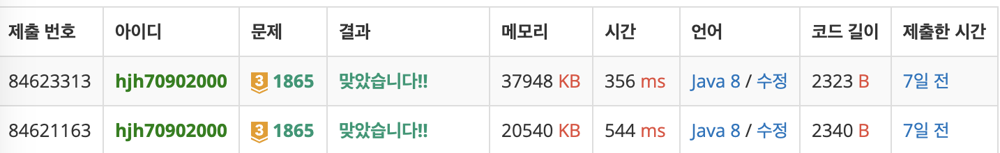

[문제 링크](https://www.acmicpc.net/problem/1865)

이번 문제는 벨만-포드를 최적화하는 ***SPFA 알고리즘***을 사용해보기 위해 난이도가 어렵지 않은 문제지만 풀어보았다.

SPFA를 빨리 정리하고 싶지만 우선 벨만포드의 학습이 선행되어야 한다.
그러니 벨만포드부터 정리해보자.

## 벨만포드의 특징
0. 1:n 최단거리 알고리즘이다.
1. 다익스트라보다 느리다.
	- 다익스트라는 `O(nlogn)`, 벨만포드는 `O(V*E)`
    - 모든 노드에 대해 모든 간선을 검사하기 때문이다.
2. 음수간선이 있더라도 작동한다!
	- 다익스트라의 경우 음수간선이 포함되면 오답을 내놓을 가능성이 생긴다.
    - 느리지만 벨만포드를 사용할 수 밖에 없는 문제가 있는 것.
3. "음수 사이클"을 검출할 수 있다!
	- 음수 사이클은 n번 노드에서 자기자신으로 돌아올 때 가중치가 음수가 되는 사이클을 말한다.
    - n번노드에서 n번노드로 가는 거리가 0 이하인 음수라면, 최단거리는 어떻게 되겠는가?
    - 음수 무한대 값이 되므로, 검출만 하면 컴퓨터는 할 일을 다 한 것이다.
    
### 문제 풀이 (벨만-포드)
```java
package 자율팀스터디.d240928;

import java.io.BufferedReader;
import java.io.IOException;
import java.io.InputStreamReader;
import java.util.ArrayList;
import java.util.Arrays;
import java.util.List;
import java.util.StringTokenizer;

public class BOJ_1865 {
	static BufferedReader br = new BufferedReader(new InputStreamReader(System.in));
	static StringTokenizer st;
	static int TC, n, m, w;
	static List<int[]> graph;
	static int[] dist;

	private static void input() throws IOException {
		st = new StringTokenizer(br.readLine());
		n = Integer.parseInt(st.nextToken());
		m = Integer.parseInt(st.nextToken());
		w = Integer.parseInt(st.nextToken());
		graph = new ArrayList<>();
		dist = new int[n + 1];
		Arrays.fill(dist, Integer.MAX_VALUE);

		int s, e, t;
		for (int i = 0; i < m; i++) {
			st = new StringTokenizer(br.readLine());
			s = Integer.parseInt(st.nextToken());
			e = Integer.parseInt(st.nextToken());
			t = Integer.parseInt(st.nextToken());
			graph.add(new int[] {s, e, t});
			graph.add(new int[] {e, s, t});
		}
		for (int i = 0; i < w; i++) {
			st = new StringTokenizer(br.readLine());
			s = Integer.parseInt(st.nextToken());
			e = Integer.parseInt(st.nextToken());
			t = Integer.parseInt(st.nextToken());
			graph.add(new int[] {s, e, -t});
		}
	}

	private static boolean bellmanFord(int start) {
		dist[start] = 0;
		int now, next, cost, nextCost;
		// 최소값 갱신. 릴랙세이션
		for (int v = 1; v <= n; v++) {
			for (int e = 0; e < graph.size(); e++) {
				now = graph.get(e)[0];
				next = graph.get(e)[1];
				cost = graph.get(e)[2];
				nextCost = dist[now] + cost;
				if (dist[now] != Integer.MAX_VALUE && dist[next] > nextCost) {
					dist[next] = nextCost;
				}
			}
		}
		// 음수 사이클 존재 확인
		for (int e = 0; e < graph.size(); e++) {
			now = graph.get(e)[0];
			next = graph.get(e)[1];
			cost = graph.get(e)[2];
			nextCost = dist[now] + cost;
			if (dist[now] != Integer.MAX_VALUE && dist[next] > nextCost) {
				return true;
			}
		}
		return false;
	}


	public static void main(String[] args) throws Exception {
		TC = Integer.parseInt(br.readLine());
		boolean ans = false;
		for (int testCase = 0; testCase < TC; testCase++) {
			input();
			for (int i = 1; i <= n; i++) {
				if (dist[i] == Integer.MAX_VALUE) {
					if (ans = bellmanFord(i)) {
						System.out.println("YES");
						break;
					}
				}
			}
			if (!ans) {
				System.out.println("NO");
			}
		}
	}


	class Node {
		int v, e;
		public Node(int v, int e) {
			this.v = v;
			this.e = e;
		}
	}
}
```
> 벨만 포드를 이해함에 있어서 위 코드를 모두 볼 필요는 없다.
> 다익스트라와 세팅을 다르게 할 것은, 연결 간선을 (출발노드, 도착노드, 가중치)로 저장한다는 것.

- `for (int v = 1; v <= n; v++)` 루프 내부에서 모든 간선을 통해 최단거리를 갱신해주는 과정을 "릴렉세이션"이라고 부른다.
- 릴렉세이션을 노드의 갯수만큼 실행해 준다.
- 위 과정을 마친 후, 한번의 릴렉세이션을 더 진행하다 최솟값 갱신이 다시 발생하면 이는 **음수사이클을 포함한 그래프**이다.
    - 직관적으로 생각해봐도, 모든 노드를 거쳐가는 것 보다 더 긴 거리를 통해 더 짧은 거리가 나온다면... 음수 사이클을 필연적으로 가지게 된다.


<br>

## SPFA (Shortest Path Faster Algorithm) 특징
- 드디어 SPFA에 대해 알아보자.
0. 벨만-포드의 베이스를 가진다.
1. 벨만-포드에서 모든 간선을 통해 릴렉세이션을 하는 과정을 **"갱신된 노드와 연결된 그래프만을 통해"** 릴렉세이션을 수행한다.
2. 이는 **최적화를 위한 알고리즘**일 뿐이며, 사실 코딩테스트에서 주는 최악의 경우의 수 에서는 시간복잡도가 여전히 `O(V * E)`이다.
	- 다르게 말하면 잘못 구현할 시 원래의 벨만포드보다 느려진다. 가능하면 Queue와 같은 단순한 자료구조를 이용하여 구현하자.
    - ~~SPFA 구현방법을 모르고 스스로 최적화를 했을 때, Set을 사용하느라 오히려 느려졌던 경험이 있다~~
    
### 문제 풀이 (SPFA)
```java
package 자율팀스터디.d240928;

import java.io.BufferedReader;
import java.io.IOException;
import java.io.InputStreamReader;
import java.util.*;

public class BOJ_1865_SPFA {
	static BufferedReader br = new BufferedReader(new InputStreamReader(System.in));
	static StringTokenizer st;
	static int TC, n, m, w;
	static List<int[]> graph[];
	static int[] dist;

	private static void input() throws IOException {
		st = new StringTokenizer(br.readLine());
		n = Integer.parseInt(st.nextToken());
		m = Integer.parseInt(st.nextToken());
		w = Integer.parseInt(st.nextToken());
		graph = new ArrayList[n + 1];
		for (int i = 0; i <= n; i++)
			graph[i] = new ArrayList<>();
		dist = new int[n + 1];
		Arrays.fill(dist, Integer.MAX_VALUE);

		int s, e, t;
		for (int i = 0; i < m; i++) {
			st = new StringTokenizer(br.readLine());
			s = Integer.parseInt(st.nextToken());
			e = Integer.parseInt(st.nextToken());
			t = Integer.parseInt(st.nextToken());
			graph[s].add(new int[] {e, t});
			graph[e].add(new int[] {s, t});
		}
		for (int i = 0; i < w; i++) {
			st = new StringTokenizer(br.readLine());
			s = Integer.parseInt(st.nextToken());
			e = Integer.parseInt(st.nextToken());
			t = Integer.parseInt(st.nextToken());
			graph[s].add(new int[] {e, -t});
		}
	}

	private static boolean spfa(int start) {
		dist[start] = 0;
		// 최소값 갱신. 릴랙세이션
		Queue<Integer> q = new ArrayDeque<>();
		boolean[] inque = new boolean[n+1];
		int[] cnt = new int[n+1];
		q.add(start);
		inque[start] = true;

		int now, next, cost;
		while (!q.isEmpty()) {
			now = q.poll();
			inque[now] = false;
			for (int[] edge : graph[now]) {
				next = edge[0];
				cost = edge[1];

				if (dist[next] > dist[now] + cost) {
					dist[next] = dist[now] + cost;
					if (!inque[next]) {
						q.add(next);
						inque[next] = true;
						cnt[next]++;
						if (cnt[next] > n)
							return true;
					}
				}
			}
		}

		return false;
	}


	public static void main(String[] args) throws Exception {
		TC = Integer.parseInt(br.readLine());
		boolean ans = false;
		for (int testCase = 0; testCase < TC; testCase++) {
			input();
			for (int i = 1; i <= n; i++) {
				if (dist[i] == Integer.MAX_VALUE) {
					if (ans = spfa(i)) {
						System.out.println("YES");
						break;
					}
				}
			}
			if (!ans) {
				System.out.println("NO");
			}
		}
	}


	class Node {
		int v, e;
		public Node(int v, int e) {
			this.v = v;
			this.e = e;
		}
	}
}
```
> 달라진 부분만 보자.
> 1. input에서 특정 노드에서 출발하는 간선을 빠르게 구분할 수 있도록 간선을 입력받았다.
> 2. BellmanFord -> SPFA로 넘어가며, 갱신된 노드만을 체크해주기 위해 queue를 사용했다.
> - queue는 자체적 중복방지가 없다. 노드가 queue에 있는지 검사해주는 inque배열을 만들었다.
> - 계산 횟수가 노드의 수를 넘어가는지 체크해주기 위해 cnt 배열을 만들었다. 이를 통해 음수 사이클을 검출한다.

연결된 간선을 통해 **최소값이 갱신된 노드**만이 다음 노드로 연결되며 **최소값을 갱신할 수 있다!**
그래서 갱신과 함께 큐에 넣어주는 것이다.

## 수확

메모리는 17메가바이트 증가했지만 시간을 약 200ms 줄일 수 있었다.
괜찮은 trade-off 관계인 것 같다.

## 후기
- 문제에 약간의 함정이 있다면, 모든 노드들이 연결되어 있지 않기에, 필요에 따라 최단거리 알고리즘을 여러 번 수행해야 한다는 점이다.

- SPFA를 몰랐을 때, 벨만포드가 모든 간선을 돌아야한다는 사실이 너무 비효율적이라 생각이 들어 연결된 간선만을 통해 갱신이 수행되도록 만들다가 `set`을 썼다.
  - 큐에 같은 노드가 들어가는 게 싫었고, `set`도 enhanced for문을 통해 순회가 가능하기에 그런 선택을 했다.
  - 결과는 대실패였다. 그때는 시간이 오히려 늘었다.
  - 좀 더 찾아보고 나서는 Queue와 중복체크 배열을 사용하여 성공적으로 구현할 수 있었다.
    - 최악의 경우에 시간을 줄여주지 못하기에, SPFA 알고리즘은 구현을 정교하게 해야 한다는 사실을 배웠다. (다행인건 별로 어렵지는 않다)
- 이렇게 한번 구현을 해놓고 나니, 앞으로 벨만 포드가 필요한 문제에서는 마음껏 응용할 수 있을 것 같다.
  - 비록 그런 문제의 수가 많지는 않지만 😅