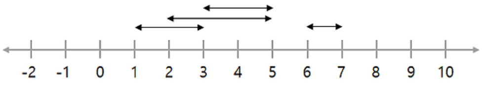
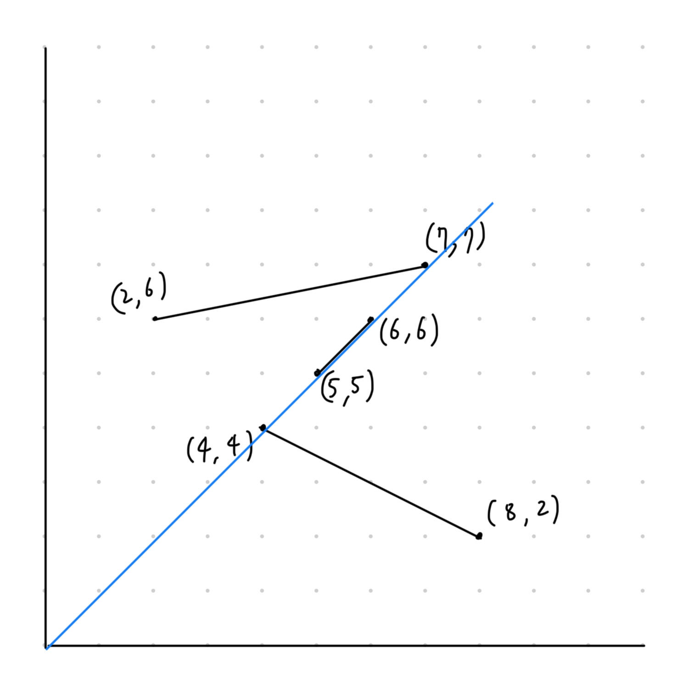

[문제 링크](https://www.acmicpc.net/problem/14266)

머리 식히려고 문제를 풀다 발견한 문제이다.

바야흐로 2019년... 내가 이와 비슷한 문제를 접하고나서 재밌는 풀이라며 넘겼던 기억이 난다.
다만 그때는 그냥 구현의 일종으로 보고, "좋은 풀이네..." 하고 알고리즘 분류와 공부를 채 제대로 하지 않고 넘어갔었다.

다시 스위핑 문제를 접하고 보니, 어렵지 않으면서도 따로 정리할 가치가 있는 문제라고 느껴 이렇게 정리하게 되었다.

## 스위핑


(그림 출처: https://byeo.tistory.com/entry/%EC%8A%A4%EC%9C%84%ED%95%91-Sweeping)

위와 같은 그림에서 수직선을 그었을 때 가장 많은 선분을 지나치는 방법은 3에 수직선을 긋는 것이다.
이를 코드를 통해 푸는 법은 다음과 같다.

1. 선분의 양쪽 끝에 +1, -1을 매핑해준다. (예 `(1, +1), (3, -1)`)
2. 매핑된 점들을 정렬한다.
3. 순서대로 +1 -1을 계산해준다.
	- cnt 라고 둘 때, `cnt = 0`
    - +1 점을 지나면 `cnt += 1` 
    - -1 점을 지나면 `cnt -= 1`
    - cnt가 현재 지나고 있는 위치에서 겹치는 선분의 수가 된다.
4. 이때 지나가는 cnt값을 그때그때 검사하여 최대값을 구하면 된다.

## 문제
그럼 본 문제로 돌아오자.

문제는 정리하자면 대충 이렇다

1. 1사분면에 위치한 여러 선분을 준다.
2. (0, 0)을 지나는 선을 그을 때, 1사분면에 위치한 선분과 가장 많이 겹치는 (선분 위의 한 점이 새로 그은 선을 지나는) 갯수를 최대한으로 할 때, 몇 개가 최대일까?

> 위의 스위핑 풀이로 문제를 풀 때, 이 문제는 약간의 응용이 필요하다.

## 풀이
### 입력
```
3
4 4 8 2
5 5 6 6
7 7 2 6
```

문제의 예시를 도식화하면 아래와 같다.



답은 파란줄처럼 기울기가 1인 선분을 그으면 된다.

> 0을 지나는 선분을 그려야 하기에, 바꿀수 있는 것은 기울기 밖에 없다.
> 모든 선분의 끝 점의 기울기를 저장하고, 작은 것에 +1, 큰 것에 -1을 매핑해주도록 하자.

모두 진행한 후의 결과물이 아래와 같으면 된다.
`[(0.25, -1), (1.0, 1), (1.0, -1), (1.0, 1), (1.0, -1), (3.0, 1)]`

이제 위 배열을 순서대로 돌면서 최대한의 cnt값을 저장하도록 하자

### 코드
```python
# 정렬된 값들을 통해 가장 높은 cnt값을 ans로 저장해 반환해준다.
def sweeping(dots: list):
    dots.sort()
    ans = 0
    cnt = 0
    for dot in dots:
        cnt -= dot[1]
        if cnt > ans:
            ans = cnt
    return ans

# 메인에서 값들을 입력받고 정렬까지 해준다.
if __name__ == "__main__":
    n = int(input())
    dots = []
    for i in range(n):
        a, b, c, d = map(float, input().split())
        a = b / a
        b = d / c
        a, b = (a, b) if a < b else (b, a)
        dots.append((a, -1))
        dots.append((b, 1))
    print(sweeping(dots))
```

## 후기
- 스위핑을 오래전에 푼 적이 있었지만 정리하지 않았기에, 이 문제를 보고 스위핑이라고 딱 떠오르지 않았다.
  - 정리할 가치가 있는 알고리즘인 것 같아, 이번 기회를 빌려 정리해보게 되었다.
- 간단한 코드임에도 정렬 제외시 O(n)의 성능으로 확실하다.
- 소숫점을 다루는 문제라 그냥 float 형을 쓰기엔 조금 무서웠는데 어쩻든 통과는 했다.
  - 비록 정확한 소수 값이 아니더라도 `10 / 30` 이든, `1 / 3`이든 같은 소수점을 갖기 때문인 것으로 생각된다.