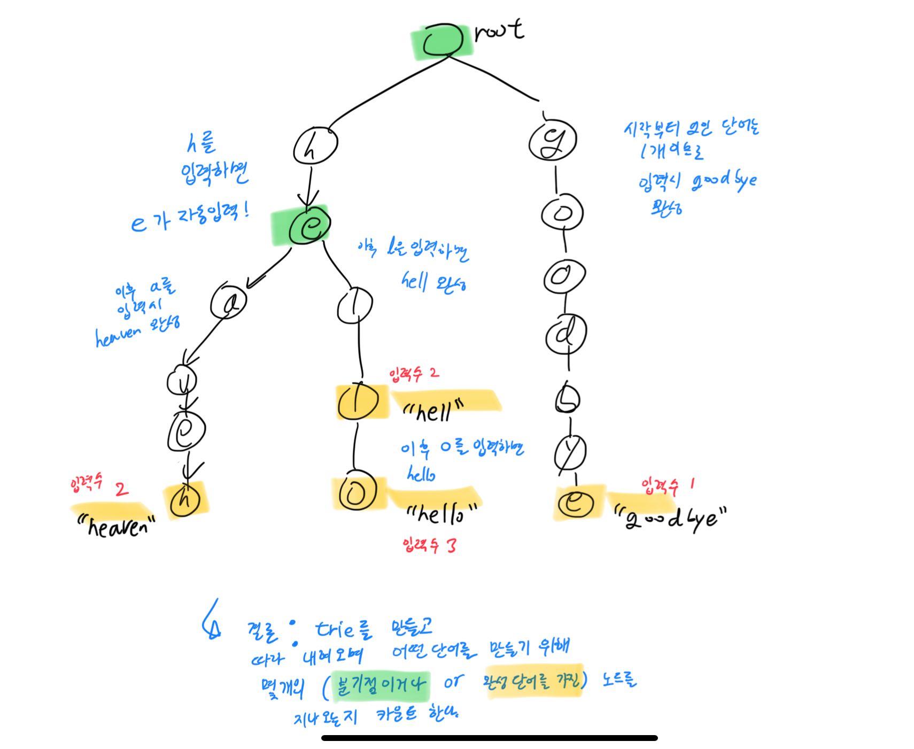

[문제 링크](https://www.acmicpc.net/problem/5670)

역시 알고리즘 스터디 문제이다.

~~트라이의 개념을 알고 있었기에 따로 구현해 본 적이 없던 와중, 직접 구현까지 해 볼 수 있는 좋은 문제였다.~~

알고보니 Java로 푼 적 있었다. 언어가 달라서 그런지 하나도 기억이 나지 않았다... 난 아직도 멀었다.

<br>
우리가 ide에서 흔히 보는 기능인 단어 추론 모듈을 핸드폰에 이식하고 싶던 승혁연구원의 문제였다.

1. 모듈이 단어의 첫 번째 글자를 추론하지는 않는다. 즉, 사전의 모든 단어가 같은 알파벳으로 시작하더라도 반드시 첫 글자는 사용자가 버튼을 눌러 입력해야 한다.
2. 길이가 1 이상인 문자열 c1c2...cn이 지금까지 입력되었을 때, 사전 안의 모든 c1c2...cn으로 시작하는 단어가 c1c2...cnc로도 시작하는 글자 c가 존재한다면 모듈은 사용자의 버튼 입력 없이도 자동으로 c를 입력해 준다. 그렇지 않다면 사용자의 입력을 기다린다.

### 입출력 예로 풀이 추론

**입력**
```
4
hello
hell
heaven
goodbye
```

**출력**
```
2.00
```


**설명**

트라이를 만들 때 위의 모양처럼 된다고 하면, 
- `goodbye`는 `g`를 입력하며  완성
- `heaven`은 `h`, `a` 를 입력하며 완성
- `hell`은 `h`, `l`을 입력하며 완성
- `hello`는 `h`, `l`을 입력한 hell에서 `o`를 한 번 더 눌러 완성!
	- 같은 길이어도 중간에 사전 단어가 있다면 다음 글자를 입력해 주어야 한다

한 단어를 완성할 때 필요한 입력 수는, `트라이를 따라 내려오며, 여러 갈래의 자식을 가진 노드이거나, 완성 단어를 가진 노드의 갯수` 이다.

따라서 트라이를 완성해 준 후 bfs로 모든 노드를 탐색하며 각 단어의 입력 수 의 평균을 내 주도록 하자

### 코드
```python
import sys
from collections import deque
input = sys.stdin.readline

root = None

class Node:
    def __init__(self) -> None:
        self.word = None
        self.kids = {}
    
    def __repr__(self) -> str:
        return f"{repr(self.kids)}{' : ' if self.word is not None else ''}{self.word if self.word is not None else ''}"

def bfs():
    q = deque()
    ans = 0

    for startK, startV in root.kids.items():
        q = deque()
        q.append((startV, 1))

        while q:
            sep = False
            tree, dist = q.popleft()
            if tree.word != None:
                ans += dist
                dist += 1
                sep = True
            if len(tree.kids) == 1:
                for nextK, nextV in tree.kids.items():
                    q.append((nextV, dist))
            else:
                for nextK, nextV in tree.kids.items():
                    q.append((nextV, dist + (1 if not sep else 0)))

    return ans


while True:
    line = input()
    if line == '':
        break
    n = int(line)
    words = [input().strip() for _ in range(n)]

    root = Node()

    for word in words:
        now = root
        for letter in word:
            if letter not in now.kids.keys():
                now.kids[letter] = Node()
            now = now.kids[letter]
        now.word = word
    
    total = bfs()
    print(f'{total/n:.2f}')
```

### 후기
- 트라이를 처음 구현한 문제였다.
  - ~~(귀찮기도 해서)~~ 클래스로는 노드만 구현하고 root를 변수로 갖고 있도록 해주었다.
  - 그래서인지 틀렸거나, 비효율적인 부분이 있을 것 같다.
  - 다른 사람들의 풀이를 참고해서 다음 trie 문제를 풀 때는 발전해보자.
- 노드는 단어와 자식들을 가진다.
  - 단어는 사전 단어일 때만 값을 갖고 기본적으로 None 이도록 구현했다.
  - 자식들은 dict 자료형을 통해 글자는 key, 자식노드는 value로 갖도록 해 주었다.
- repr 함수를 잘 이용하면 디버깅에 도움이 많이 되겠구나.
  - 파이썬에서 str 함수는 개발자가 아닌 클라이언트를 위한 함수였구나